# MQ-VAE Model Flowchart

```mermaid
flowchart TD
    %% Input Layer
    Input["Input Contact Matrix\n(B×1×256×256)"]
    AssayID["Assay ID\n[B] (4 assays)"]
    
    %% Encoder Components
    AssayEmbed["Assay Embedding\n(4 assays → 8)"]
    FiLM["FiLMLayer\nγ, β projections\n8→32"]
    Stage1["Stage1 Conv2d\n1→32, k=7, s=2\n(B×32×128×128)"]
    Stage2["Stage2 ResBlock\n32→64, s=2\n(B×64×64×64)"]
    Stage3["Stage3 ResBlock\n64→128, s=2\n(B×128×32×32)"]
    Stage4["Stage4 ResBlock\n128→256, s=1\n(B×256×32×32)"]
    Reshape["Reshape\n(B×256×32×32) → (B×1024×256)"]
    
    %% Masking Components
    Masker["VanillaMasker\nScorer MLP\n256→64→1"]
    TempControl["Temperature τ_f\n1.0→0.5 over epochs"]
    Gumbel["Gumbel-Softmax\nTraining: stochastic\nInference: deterministic"]
    VisibleTokens["Visible Tokens\n(B×512×256)"]
    VisibleIndices["Visible Indices\n[B×512]"]
    
    %% Vector Quantization
    Codebook["EMA Codebook\n512×256"]
    VQ["EMAVectorQuantizer\nNearest neighbor"]
    Quantized["Quantized Tokens\n(B×512×256)"]
    CommitLoss["Commitment Loss\nMSE(z_e, z_q)"]
    CodeIndices["Code Indices\n[B×512]"]
    
    %% Fingerprint Extraction
    FingerprintPool["Pooling Strategy\nMean or Attention"]
    FPProjection["FP Projection\n256→32"]
    Fingerprint["Fingerprint\n[B×32]"]
    Histogram["Histogram\n[B×512] (optional)"]
    
    %% Transformer Demasker
    MaskTokens["Mask Tokens\nLearnable\n[1×1×256]"]
    PosEmbed["Positional Embedding\n[1×1024×256]"]
    Scatter["Scatter Tokens\nBuild full sequence"]
    InputProj["Input Projection\n256→128"]
    TransformerBlocks["4× TransformerBlocks\nMHSA + FFN\ndim=128"]
    OutputProj["Output Projection\n128→256"]
    DemaskedOut["Demasked Features\n(B×1024×256)"]
    
    %% Decoder
    SpatialReshape["Spatial Reshape\n(B×1024×256) → (B×256×32×32)"]
    Up1["UpsampleBlock 1\nResBlock 256→128\n2× bilinear upsample\n(B×128×64×64)"]
    Up2["UpsampleBlock 2\nResBlock 128→64\n2× bilinear upsample\n(B×64×128×128)"]
    Up3["UpsampleBlock 3\nResBlock 64→32\n2× bilinear upsample\n(B×32×256×256)"]
    
    %% Output Heads
    ContactHead["ContactReconHead\nConv 32→16→1\n(B×1×256×256)"]
    CellClassifier["CellClassifierHead\nMLP 256→128→64→16\n[B×16]"]
    
    %% Outputs
    Reconstructed["Reconstructed Contact\n(B×1×256×256)"]
    CellLogits["Cell Type Logits\n[B×16]"]
    
    %% Ablation Branches
    NoMasking["Ablation: No Masking\nAll 1024 tokens"]
    NoFiLM["Ablation: No FiLM\nZero assay embedding"]
    
    %% Flow Connections
    %% Input to Encoder
    Input --> Stage1
    AssayID --> AssayEmbed
    AssayEmbed --> FiLM
    FiLM -->|"modulate features"| Stage1
    
    %% Encoder Pipeline
    Stage1 --> Stage2 --> Stage3 --> Stage4 --> Reshape
    
    %% Ablation branches
    Reshape --> Masker
    Reshape --> NoMasking
    NoMasking --> VQ
    
    %% Masking Pipeline
    Masker --> TempControl
    TempControl --> Gumbel
    Gumbel --> VisibleTokens
    Gumbel --> VisibleIndices
    
    %% Quantization Pipeline
    VisibleTokens --> VQ
    Codebook --> VQ
    VQ --> Quantized
    VQ --> CommitLoss
    VQ --> CodeIndices
    
    %% Fingerprint Pipeline
    Quantized --> FingerprintPool
    FingerprintPool --> FPProjection
    FPProjection --> Fingerprint
    CodeIndices --> Histogram
    
    %% Demasker Pipeline
    Quantized --> Scatter
    VisibleIndices --> Scatter
    MaskTokens --> Scatter
    PosEmbed --> Scatter
    Scatter --> InputProj
    InputProj --> TransformerBlocks
    TransformerBlocks --> OutputProj
    OutputProj --> DemaskedOut
    
    %% Decoder Pipeline
    DemaskedOut --> SpatialReshape
    SpatialReshape --> Up1 --> Up2 --> Up3
    
    %% Output Heads
    Up3 --> ContactHead
    ContactHead --> Reconstructed
    
    %% Cell Classifier (from pre-VQ features)
    VisibleTokens -->|"mean pool"| CellClassifier
    CellClassifier --> CellLogits
    
    %% Ablation connections
    AssayEmbed --> NoFiLM
    NoFiLM -->|"zero modulation"| Stage1
    
    %% Styling
    style Input fill:#1a1a2e,color:#eee
    style AssayID fill:#1a1a2e,color:#eee
    style AssayEmbed fill:#16213e,color:#eee
    style FiLM fill:#16213e,color:#eee
    style Stage1 fill:#0f3460,color:#eee
    style Stage2 fill:#0f3460,color:#eee
    style Stage3 fill:#0f3460,color:#eee
    style Stage4 fill:#0f3460,color:#eee
    style Reshape fill:#0f3460,color:#eee
    style Masker fill:#2b4162,color:#eee
    style TempControl fill:#2b4162,color:#eee
    style Gumbel fill:#2b4162,color:#eee
    style VisibleTokens fill:#2b4162,color:#eee
    style VisibleIndices fill:#2b4162,color:#eee
    style Codebook fill:#e94560,color:#fff
    style VQ fill:#e94560,color:#fff
    style Quantized fill:#e94560,color:#fff
    style CommitLoss fill:#e94560,color:#fff
    style CodeIndices fill:#e94560,color:#fff
    style FingerprintPool fill:#f39c12,color:#fff
    style FPProjection fill:#f39c12,color:#fff
    style Fingerprint fill:#f39c12,color:#fff
    style Histogram fill:#f39c12,color:#fff
    style MaskTokens fill:#0a3d62,color:#eee
    style PosEmbed fill:#0a3d62,color:#eee
    style Scatter fill:#0a3d62,color:#eee
    style InputProj fill:#0a3d62,color:#eee
    style TransformerBlocks fill:#0a3d62,color:#eee
    style OutputProj fill:#0a3d62,color:#eee
    style DemaskedOut fill:#0a3d62,color:#eee
    style SpatialReshape fill:#1e3799,color:#eee
    style Up1 fill:#1e3799,color:#eee
    style Up2 fill:#1e3799,color:#eee
    style Up3 fill:#1e3799,color:#eee
    style ContactHead fill:#079992,color:#fff
    style CellClassifier fill:#079992,color:#fff
    style Reconstructed fill:#b8e994,color:#000
    style CellLogits fill:#b8e994,color:#000
    style NoMasking fill:#7f8c8d,color:#fff,stroke-dasharray: 5 5
    style NoFiLM fill:#7f8c8d,color:#fff,stroke-dasharray: 5 5
```



## Key Components Explained

### **1. Encoder (Blue)**
- **Input**: Hi-C contact matrix `[B, 1, 256, 256]`
- **Assay Conditioning**: FiLM layer modulates features based on assay type
- **CNN Stages**: 4-stage CNN with ResBlocks, outputs 1024 spatial tokens

### **2. Masking (Purple)**
- **Learned Selection**: Scorer network learns importance scores
- **Temperature Control**: Gumbel-Softmax with annealing schedule
- **Output**: 512 visible tokens + their positions

### **3. Vector Quantization (Red)**
- **Codebook**: 512 discrete codes × 256 dimensions
- **EMA Updates**: Stable learning without gradient to codebook
- **Commitment Loss**: Pulls encoder outputs toward codebook

### **4. Fingerprint Extraction (Orange)**
- **Pooling**: Mean or attention pooling over tokens
- **Projection**: 256→32 dimensional fingerprint
- **Purpose**: Compact representation for database storage

### **5. Transformer Demasker (Teal)**
- **Sequence Building**: Scatters visible tokens, fills with mask tokens
- **Positional Encoding**: Learnable spatial positions
- **Transformer Processing**: 4 blocks with dimension compression (256→128)
- **Output**: Full 1024-token sequence for reconstruction

### **6. Decoder (Indigo)**
- **Upsampling**: 3 stages of ResBlock + 2× bilinear upsample
- **Progressive**: 256→128→64→32 channels
- **Output**: 32-channel 256×256 feature map

### **7. Output Heads (Green)**
- **Contact Reconstruction**: Conv layers predict full contact map
- **Cell Classification**: MLP predicts cell type from pre-VQ features

### **8. Ablation Branches (Gray, Dashed)**
- **No Masking**: All tokens pass to VQ (tests masking importance)
- **No FiLM**: Zero assay embedding (tests conditioning importance)

## Data Flow Summary

```
Input: [B, 1, 256, 256] + [B] assay_id
  ↓
Encoder: 4-stage CNN → [B, 1024, 256]
  ↓
Masker: Learned selection → [B, 512, 256] + indices
  ↓
VQ: Quantization → [B, 512, 256] + indices + fingerprint
  ↓
Demasker: Transformer → [B, 1024, 256]
  ↓
Decoder: Upsampling → [B, 32, 256, 256]
  ↓
Heads: Contact recon [B, 1, 256, 256] + Cell logits [B, 16]
```

The flowchart shows the complete data pipeline with all tensor shapes, component details, and ablation branches for comprehensive understanding of the MQ-VAE architecture.
